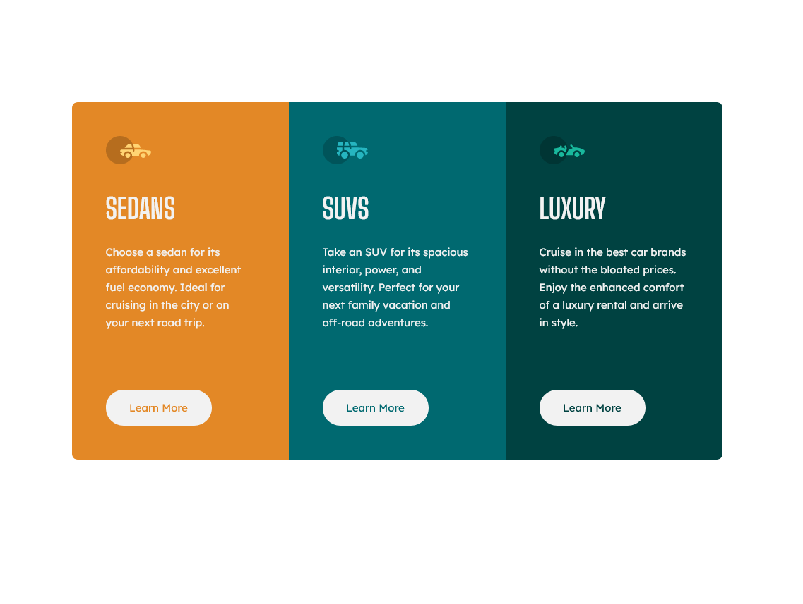

# Frontend Mentor - 3-column preview card component solution

This is a solution to the [3-column preview card component challenge on Frontend Mentor](https://www.frontendmentor.io/challenges/3column-preview-card-component-pH92eAR2-). Frontend Mentor challenges help you improve your coding skills by building realistic projects.

## Table of contents

- [Overview](#overview)
  - [The challenge](#the-challenge)
  - [Screenshot](#screenshot)
  - [Links](#links)
- [My process](#my-process)
  - [Built with](#built-with)
  - [What I learned](#what-i-learned)
  - [Continued development](#continued-development)
  - [Useful resources](#useful-resources)
- [Author](#author)

**Note: Delete this note and update the table of contents based on what sections you keep.**

## Overview

### The challenge

Users should be able to:

- View the optimal layout depending on their device's screen size
- See hover states for interactive elements

### Screenshot



### Links

- Solution URL: [3-column-preview-card-component](https://www.frontendmentor.io/solutions/mobilefirst-solution-using-css-grid-3-column-preview-card-component-I-Pn_twl7F)
- Live Site URL: [3-column-preview-card-component](https://wdaz.github.io/3-column-preview-card-component/)

## My process

### Built with

- Semantic HTML5 markup
- CSS custom properties
- CSS Grid
- Mobile-first workflow

### What I learned

```css
.button {
  --_bg-color: var(--white);
  --_font-size: var(--base-font-size);

  background-color: var(--_bg-color);
  font-size: var(--_font-size);
}

.button:hover {
  --_bg-color: transparent;
}
```

### Continued development

My focus right now is on the CSS Grid. I want improve this.

### Useful resources

- [Using CSS custom properties like this is a waste](https://www.youtube.com/watch?v=_2LwjfYc1x8) - This helped me use custom properties differently.

## Author

- Frontend Mentor - [@wdaz](https://www.frontendmentor.io/profile/wdaz)
- Linkedin - [@ruslan-hagverdi](https://www.linkedin.com/in/ruslan-hagverdi/)
